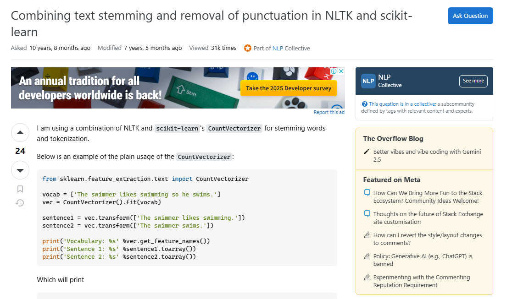
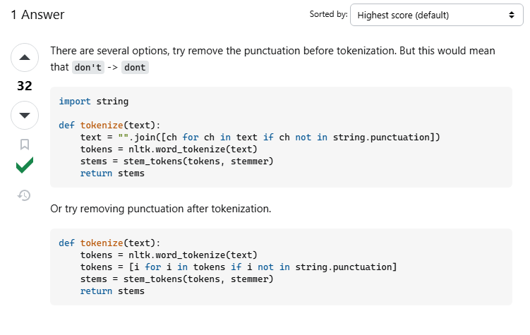

**Atividade: Processamento de Linguagem Natural - Atividade 1**

---

# Tutorial: Combinação de Stemming e Remoção de Pontuação em NLTK e Scikit-Learn

**Pergunta escolhida:** [Combining text stemming and removal of punctuation in nltk and scikit-learn](https://stackoverflow.com/questions/26126442/combining-text-stemming-and-removal-of-punctuation-in-nltk-and-scikit-learn/26132560#26132560)

**Participantes da equipe:**

* Heitor Santos
* Itor Queiroz
* Lanna Silva
* Lavínia Santos
* Rômulo Santana

---
# 1. Escolha da pergunta

*Perguntas separadas pelo filtro inicial de escolhas:* 

* [Understanding Text feature extraction TfidfVectorizer in python scikit-learn](https://stackoverflow.com/questions/47557417/understanding-text-feature-extraction-tfidfvectorizer-in-python-scikit-learn)
* [Combining text stemming and removal of punctuation in nltk and scikit-learn](https://stackoverflow.com/questions/26126442/combining-text-stemming-and-removal-of-punctuation-in-nltk-and-scikit-learn/26132560#26132560)
* [Disabling part of the nlp pipeline](https://stackoverflow.com/questions/53870599/disabling-part-of-the-nlp-pipeline)

*Pergunta escolhida:*

*Resposta:*


# 2. Descrição do problema

A pergunta no Stack Overflow trata de como integrar **stemming** (processo de reduzir uma palavra ao seu radical) e **remoção de pontuação** em um pipeline de processamento de texto utilizando as bibliotecas **NLTK** e **Scikit-Learn**.

O autor quer que o texto seja:

* Normalizado (lowercase);
* Sem pontuação;
  

# 3. Solução adotada (resposta aceita)

A solução correta, marcada como aceita, define uma função personalizada de tokenização, que remove a pontuação.

### Resultado esperado:

* Vocabulário com palavras reduzidas à raiz
* Sem pontuação
* Sem distinção entre "Swimming", "Swim", etc.


# 4. Código da solução

**Parte 1: Importando Bibliotecas**
Esta parte importa as bibliotecas necessárias para a solução.
*   `string`: Fornece operações em strings, usado aqui para remoção de pontuação.
*   `CountVectorizer`: Do scikit-learn, usado para converter uma coleção de documentos de texto em uma matriz de contagens de tokens.
*   `word_tokenize`: Do NLTK, usado para tokenizar o texto.
*   `PorterStemmer`: Do NLTK, usado para derivar palavras à sua forma raiz.

```python
import string
from sklearn.feature_extraction.text import CountVectorizer
from nltk import word_tokenize
from nltk.stem.porter import PorterStemmer
```

**Parte 2: Uso simples do CountVectorizer**
Esta parte demonstra o uso simples do CountVectorizer sem qualquer tokenização ou stemming personalizado.

*Um vocabulário é definido.
*O CountVectorizer é ajustado ao vocabulário.
*As frases são transformadas usando o vetorizador ajustado.
*O vocabulário e as frases transformadas são impressos.

```python
#uso simples do CountVectorizer
vocab = ['The swimmer likes swimming so he swims.']
vec = CountVectorizer().fit(vocab)

sentence1 = vec.transform(['The swimmer likes swimming.'])
sentence2 = vec.transform(['The swimmer swims.'])

#Nome está diferente da pergunta do stackoverflow pois o nome do método foi alterado em versões mais recentes do sklearn
print('Vocabulary: %s' %vec.get_feature_names_out())
print('Sentence 1: %s' %sentence1.toarray())
print('Sentence 2: %s' %sentence2.toarray())
```
**Parte 3: Definindo Funções para Stemming e Tokenização**
Esta parte define as funções necessárias para realizar o stemming e a tokenização do texto.
*   `stem_tokens`: Aplica o stemming a cada token na lista de tokens.
*   `tokenize`: Remove a pontuação do texto e tokeniza as palavras, aplicando o stemming em seguida.

```python
stemmer = PorterStemmer()
def stem_tokens(tokens, stemmer):
    stemmed = []
    for item in tokens:
        stemmed.append(stemmer.stem(item))
    return stemmed

def tokenize(text):
    # OPCAO 1: Remove punctuation before tokenization
    text = "".join([ch for ch in text if ch not in string.punctuation])
    tokens = word_tokenize(text)
    # OPCAO 2: Remove punctuation after tokenization
    tokens = [i for i in tokens if i not in string.punctuation]
    stems = stem_tokens(tokens, stemmer)
    return stems
```
**Parte 4: Usando CountVectorizer com Tokenização e Stemming Personalizados**
Esta parte demonstra como usar o CountVectorizer com as funções de tokenização e stemming personalizadas.

*O CountVectorizer é inicializado com o tokenizer personalizado, stop words em inglês e token_pattern definido como None.
*O vocabulário é ajustado usando o CountVectorizer personalizado.
*As frases são transformadas usando o vetorizador ajustado.
*O vocabulário e as frases transformadas são impressos.

```python
vect = CountVectorizer(tokenizer=tokenize, stop_words='english', token_pattern=None)

vect.fit(vocab)

sentence1 = vect.transform(['The swimmer likes swimming.'])
sentence2 = vect.transform(['The swimmer swims.'])

print('Vocabulary: %s' %vect.get_feature_names_out())
print('Sentence 1: %s' %sentence1.toarray())
print('Sentence 2: %s' %sentence2.toarray())
```
# 5. Motivos da rejeição das outras respostas

Nessa pergunta em especifico somente uma reposta foi enviada, mas a segunda solução dada pelo mesmo usuário não remove pontuações com mais de um caracter. ex: '...'

---

# 6. Referências

* Stack Overflow - [Pergunta Original](https://stackoverflow.com/questions/26126442/combining-text-stemming-and-removal-of-punctuation-in-nltk-and-scikit-learn/26132560#26132560)
* Documentação NLTK: [https://www.nltk.org](https://www.nltk.org)
* Scikit-learn: [https://scikit-learn.org](https://scikit-learn.org)

---

